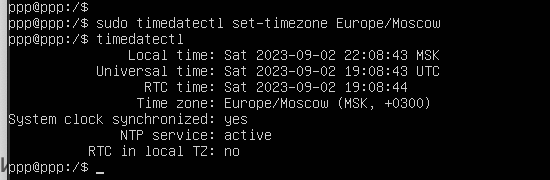
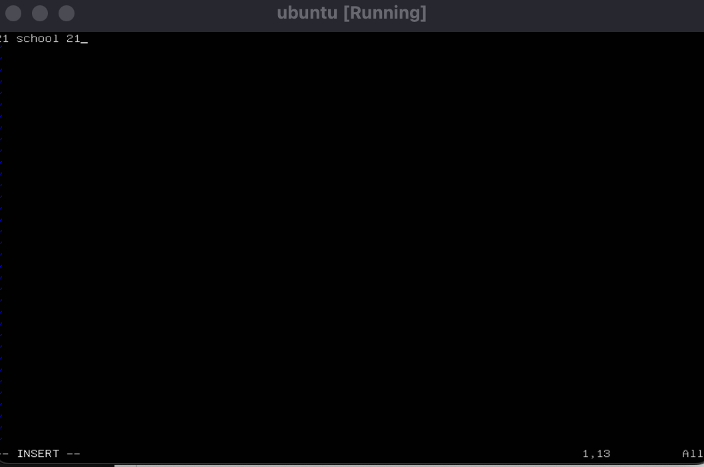
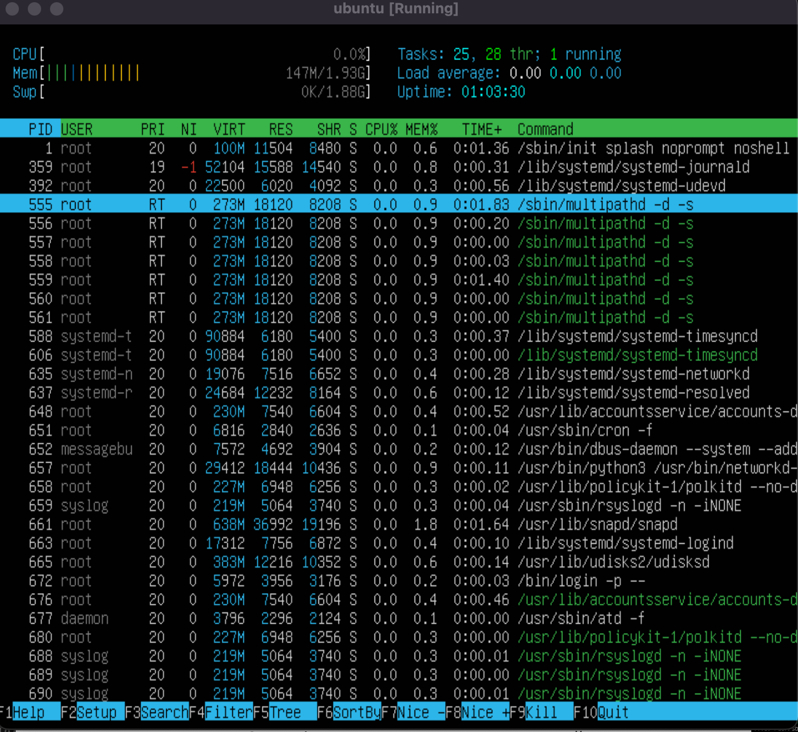
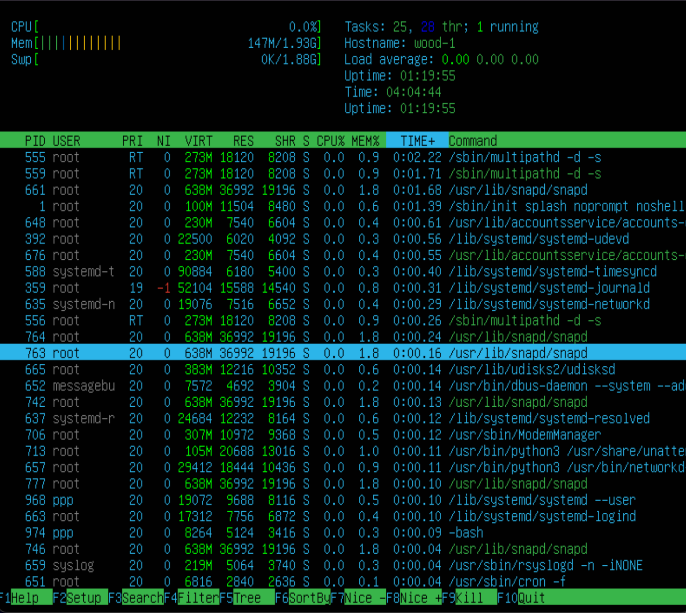
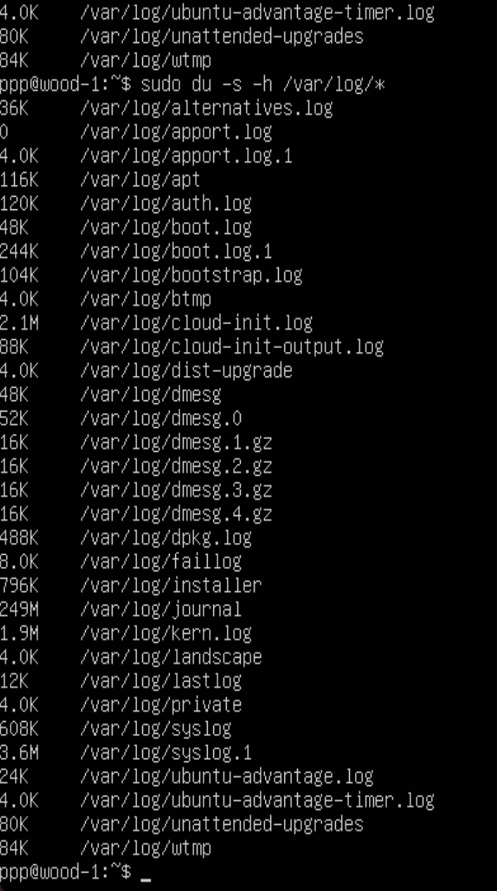
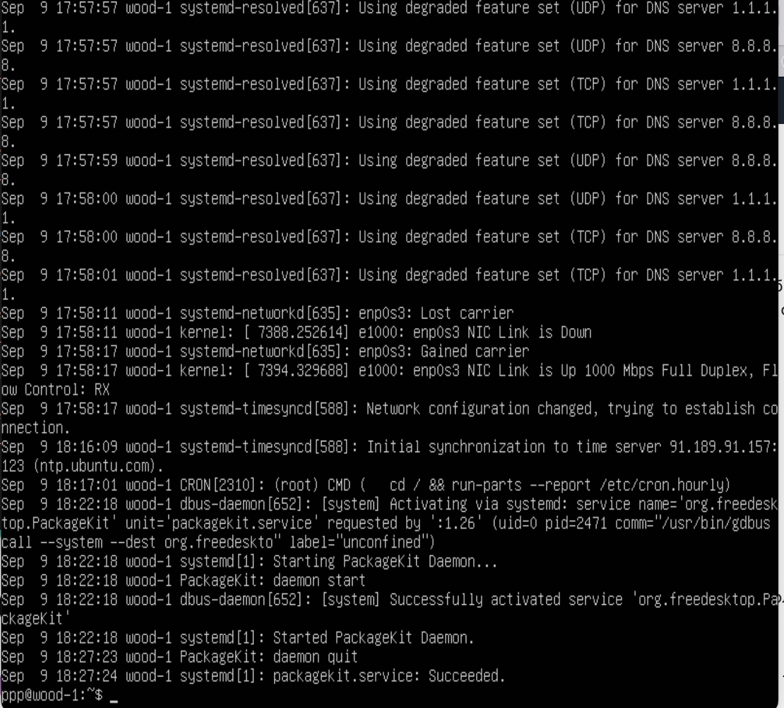

## Part 1. Установка ОС

* #### Устанвливаем Ubuntu 20.04 Server LTS без графического интерфейса. (Используя программу для виртуализации - VirtualBox) 
Узнаем версию Ubuntu, выполнив команду 
``cat /etc/issue``

***
## Part 2. Создание пользователя
* ####  Создаем пользователя, отличного от пользователя, который создавался при установке. Добавляем в группу ``adm``
* Пишем команду ``sudo adduser www``
* Добавляем в группу ``adm`` командой ``sudo usermod -aG adm www`` 
* Для проверки вбиваем команду ``cat /etc/passwd``

или так 

***
## Part 3. Настройка сети ОС
* #### Задаем название машины вида  user-1 
* Вводим ``Sudo vim /etc/hostname`` 
* Нажимаем ``i``
* Меняем содержимое 
* Нажимаем  ``esc`` 
* Вводим ``:wq!``
* Проверяем командой ``hostname``

* #### Установливаем временную зону, соответствующую текущему местоположению 
* Вводим команду `` sudo date -s «00:00»``
* Проверяем командой ``timedatectil``
> __Меняет время, но не местоположение__

* Вводим команду ``Timedatectl list-timezones`` 
* Нажимаем ``q``
* Вводим команду ``Sudo timedatectl set-timezone Europe/Moscow`` 
* Проверяем командой ``timedatectil``

 

* #### Выводим названия сетевых интерфейсов с помощью консольной команды
* Вводим команду ``ip link show`` 

 

* Краткая версия выводится командой `` ip  -br link show``

 

> Lo - Виртуальный интерфейс, присутствующий по умолчанию в любом Linux. Он используется для отладки сетевых программ и запуска серверных приложений на локальной машине. Любой трафик, который посылается компьютерной программой на интерфейс loopback, тут же получается тем же интерфейсом. Этот механизм работает без какого-либо активного подключения, поэтому он полезен для тестирования служб, не подвергая их безопасность риску, как при удаленном сетевом доступе. Подобным образом, пингование адреса loopback — это основной тест функционирования IP стека в операционной системе.Отдельная среда передачи данных (локальная сеть) также имеет собственный адрес. Если представить IP-адрес в виде линейки из 32 битов, она строго разделяется на две части: столько-то битов слева отводится под адрес сети, а оставшиеся – под адрес абонента в этой сети. Для того чтобы определить размер адреса сети, используется сетевая маска – линейка из 32 битов, в которой на месте адреса сети стоят единицы, а на месте адреса компьютера – нули. При наложении маски на IP-адрес все единицы в нем, которым соответствуют нули в маске, превращаются в нули. Таким образом вычисляется IP-адрес сети.

* #### Используя консольную команду получаем ip адрес устройства, на котором работаю, от DHCP сервера
 * Вводим команду ``IP address`` 

 

  >DHCP - Dynamic Host Configuration Protocol
* #### Определяем и выводим на экран внешний ip-адрес шлюза (ip) и внутренний IP-адрес шлюза, он же ip-адрес по умолчанию (gw)
* Внутренний выводится командой ``Ping -c 3 localhost`` 

 

* Ip в локальной сети выводим командой  ``ip -br a``

 

* Внешний выводится с помощью команды ``ip route`` 

 

* #### Задаем статичные (заданные вручную, а не полученные от DHCP сервера) настройки ip, gw, dns (использую публичный DNS сервер)
* Вводим `` sudo apt install net-tools ``  
* Вводим `` ifconfig`` 
*  Смотрим название файла, который нужно изменить `` Ls /etc/netplan `` 
* Меняем содержимое файла командой `` sudo nano /etc/netplan  
00-installer-config.yami `` 

 
 

* #### Перезагружаю виртуальную машину. Убедаюсь, что статичные сетевые настройки (ip, gw, dns) соответствуют заданным в предыдущем пункте
* Пишем `` sudo reboot now `` для перезапуска 
* Пишем ``iconfig`` и сверяем настройки 

* Проверяем dns сервера командами ``ping -c 5 ya.ru | grep packet `` и ``ping -c 5 1.1.1.1 | grep packet ``

## Part 4. Обновление ОС
* #### Обновляем системные пакеты до последней на момент выполнения задания версии 
* Пишем команду ``sudo apt update``

***
## Part 5. Использование команды sudo
> sudo (англ. Substitute User and do, дословно «подменить пользователя и выполнить») 
* #### Разрешаю пользователю, созданному в Part 2, выполнять команду sudo
* Выполняется командой ``sudo usermod -aG sudo www``
* Проверяем 

* #### Меняю  hostname ОС от имени пользователя, созданного в пункте Part 2 (используя sudo)
Было

Стало 

***
## Part 6. Установка и настройка службы времени
* #### Настраиваю службу автоматической синхронизации времени
* Смотрим фактическое время 

* Устанавливаем NTP командой ``sudo install apt ntp``
* ``sudo install apt ntpdate``
* ``sudo systemictl enable ntp``
* ``sudo systemictl start ntp``
> Далее должна сработать команда ``sudo timedatectl set-ntp on``, но мне не повезло 
* ``sudo apt remove ntp``
* ``sudo apt install --reinstall systemd-timesyncd``
* ``sudo dpkg-reconfigure tzdata``
* ``cat /etc/timezone``
* `` timedatectl status`` 

* Проверяем 

>Вывод следующей команды содержит ``NTPSynchronized=yes: 
timedatectl show``
***
## Part 7. Установка и использование текстовых редакторов
* #### Установливаю текстовые редакторы VIM, NANO и JOE 
* ``sudo apt install vim``
* ``sudo apt install nano``
* ``sudo apt install joe``

* #### Используя каждый из трех  редакторов, создаю файл test_X.txt, где X -- название редактора, в котором создан файл. Пишу в нём свой никнейм, закрываю  файл с сохранением изменений
* Ввоожу `` sudo vim test_vim.txt `` 
* ``i``

* для выхода  ``esc``
*  пишу ``:wq``
***
* Ввоожу `` sudo nano test_nano.txt `` 

* для выхода пишу ``control x``
* ``y``
***
* Ввоожу `` sudo joe test_joe.txt `` 
* ``i``
* для поиска ввожу
``control k f b`` 

* для выхода пишу ``control k d``
* ``control c``
* ``y``

* #### Используя каждый из трех выбранных редакторов, открываю файл на редактирование, редактирую файл, заменив никнейм на строку "21 School 21", закрываю файл без сохранения изменений
* Ввоожу `` sudo vim test_vim.txt `` 
* ``i``

* для выхода  ``esc``
* пишу``:q!``
***
* Ввоожу `` sudo nano test_nano.txt `` 

* для выхода пишу ``control x``
* ``n``
***
* Ввоожу `` sudo joe test_joe.txt `` 

* для выхода 
* ``control c``
* ``y``

* #### Используя каждый из трех выбранных редакторов, редактирую файл ещё раз (по аналогии с предыдущим пунктом), а затем осваиваю функции поиска по содержимому файла (слово) и замены слова на ``mood``
* Ввоожу `` sudo vim test_vim.txt `` 
* ``i``
* меняю фаил 

* поиск через
* ``esc``
* `` /``

* для замены пишу 
 ``esc``
 ``:%s/cat/mood/g``

 

  ``enter``
***
* Ввоожу `` sudo nano test_nano.txt `` * меняю фаил 

* поиск через ``control w``

* для замены пишу 
 ``Ctrl+\``
 ``Cat``
 ``Enter``
 ``Mood``
  ``Enter``
 ``y``

 
***
 * Ввоожу `` sudo joe test_joe.txt `` * меняю фаил 

* поиск через ``control k f``
 ``Cat``
   ``Enter``
`` b``
  ``Enter``

* для замены пишу 
 ``Ctrl k f``
 ``Cat``
   ``Enter``
 ``b r``
   ``Enter``
 ``Mood``
  ``Enter``
   ``y``

 

***
## Part 8. Установка и базовая настройка сервиса SSHD
* #### Установливаю службу SSHd.
* Вводим команды:
``sudo apt update``
``sudo apt-get install ssh``
``sudo apt install openssh-server``
* #### Добавляю автостарт службы при загрузке системы.
*  Выполняем команду ``sudo systemctl enable sshd``
 * ####  Перенастраиваю службу SSHd на порт 2022
* Выполняем команду sudo ``sudo nano /etc/ssh/sshd_config``

 

* #### Используя команду ps, показываю наличие процесса sshd. Для этого к команде нужно подобрать ключи 
>Команда ps (сокращение от Process Status) — это утилита командной строки, с помощью которой можно посмотреть информацию о запущенных процессах в системе Linux
Ключ -e позволяет посмотреть ВСЕ запущенные процессы

Выполняем команду ``ps -e | grep ssh`` и видим наличие процесса ssh 

 

* #### Перезагружаю систему
* ``reboot``
 * Затем ``netstat -tan`` и смотрим результат

 

 > Ключ -а - отображение всех подключений и ожидающих портов.
Ключ -n - отображение адресов и номеров портов в числовом формате.
Ключ -t - отображение текущего подключения в состоянии переноса нагрузки с процессора на сетевой адаптер при передаче данных ( "offload" ).
Proto: Содержит тип протокола
Recv-Q: Счетчик байтов не скопированных программой пользователя из этого сокета.
Send-Q: Счетчик байтов не подтвержденных удаленным узлом
Local Address: Адрес и номер порта локального конца сокета
Foreign Address: Адрес и номер удаленного порта сокета
LISTEN: Сокет ожидает входящих подключений
0.0.0.0: это немаршрутизируемый адрес IPv4, который используется в качестве адреса по умолчанию или адреса заполнителя.

***
## Part 9. Установка и использование утилит top, htop
* #### Установливаю и запускаю утилиту top
* uptime

* количество авторизованных пользователей

* общая загрузка системы

* общее количество процессов

* загрузка cpu

* загрузка памяти

* pid процесса занимающего больше всего памяти ``Shift+M``

* pid процесса, занимающего больше всего процессорного времени ``Shift+T``

* #### Установливаю и запускаю утилиту htop
> use F6

* Сортировка по ``PID``

 * Сортировка по ``PERCENT_CPU``

 

 * Сортировка по ``PERCENT_MEM`` 

 

 * Сортировка по ``TIME`` 

 

* Сортировка  для процесса ``sshd`` 
> use F4

* с процессом ``syslog``, найденным, используя поиск
> use F3

* с добавленным выводом ``hostname``, ``clock`` и ``uptime``
> use F2

***
## Part 10. Использование утилиты fdisk
* #### Запускаю команду fdisk -l

``Disk /dev/sda: 14.98 GiB, 16054747136 bytes, 31356928 sectors``
***
## Part 11. Использование утилиты df
* #### Запускаю команду df.
* Для корневого раздела (/):

> Размеры в байтах 

* размер раздела 10218772
* размер занятого пространства 4917312
* размер свободного пространства 4760788
* процент использования 51% 

* #### Запускаю команду df -Th
* Для корневого раздела (/):
> Тип файловой системы ``ext4``
* размер раздела 9.8G
* размер занятого пространства 4.7G
* размер свободного пространства 4.6G
* процент использования 51%

***
## Part 12. Использование утилиты du
* #### Запускаю команду du
*  Вывожу размер папок ``/home``, ``/var``, ``/var/log`` (в байтах, в человекочитаемом виде)

* #### Вывожу размер всего содержимого в /var/log (не общее, а каждого вложенного элемента, используя *)

***
## Part 13. Установка и использование утилиты ncdu
* #### Установливаю утилиту ncdu
* Вывожу размер папки ``/home``

* Вывожу размер папки ``/var``

 

* Вывожу размер папки ``/var/log``

***
## Part 14. Работа с системными журналами
* #### Открываю для просмотра:

* 1. ``/var/log/dmesg``

* 2. `` /var/log/syslog``

* 3. ``/var/log/auth.log``

*** 
* > Время последней успешной авторизации 9 сентября 01:03 , имя пользователя ppp и метод входа в систему - терминал

* Перезапуск ``ssh``
* Скрин с сообщением о рестарте службы

***
## Part 15. Использование планировщика заданий CRON
* #### Используя планировщик заданий, запускаю команду uptime через каждые 2 минуты
* Пишем задачу для КРОНа через ``sudo crontab -e`` 

*  Запускаем ``CRON`` через ``sudo service cron start``
* Проверяем выполнение 

* Выводим на экран список текущих заданий для ``CRON``

* #### Удаляю все задания из планировщика заданий

* Выполняем ``sudo crontab -e`` и удаляем задачи
* Останавливаем ``CRON`` через ``sudo service cron stop``
* Проверяем через команду ``crontab -l``, что список команд пуст

***
§§§
